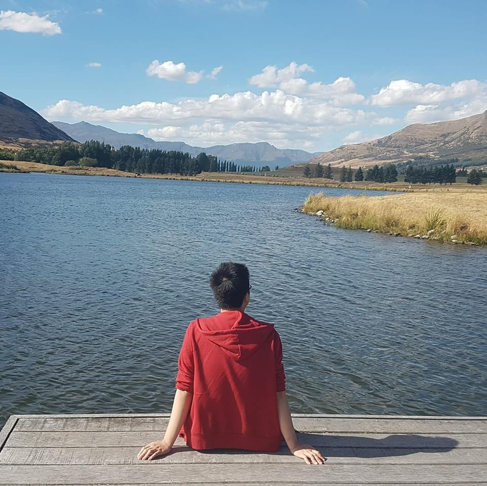

Hi There!

Welcome to my blog, my name is Terry Duong. I'm a monitoring engineer with a **strong** interest in AWS. Hoping to make a career change to become a cloud engineer. This blog is my first 'serverless' project and will be where I post on my journey in the cloud world. I'll write about my personal projects, the idea behind and how I tackle them. If you love scripting and the cloud, you'll feel right at home here. Thank you for visiting and let learn the cloud together!

Oh if you're wondering about my avatar, it's from Ponyo by Ghibli Studio, a wonderful mermaid take from the east.

Regards,

TD
